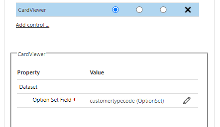
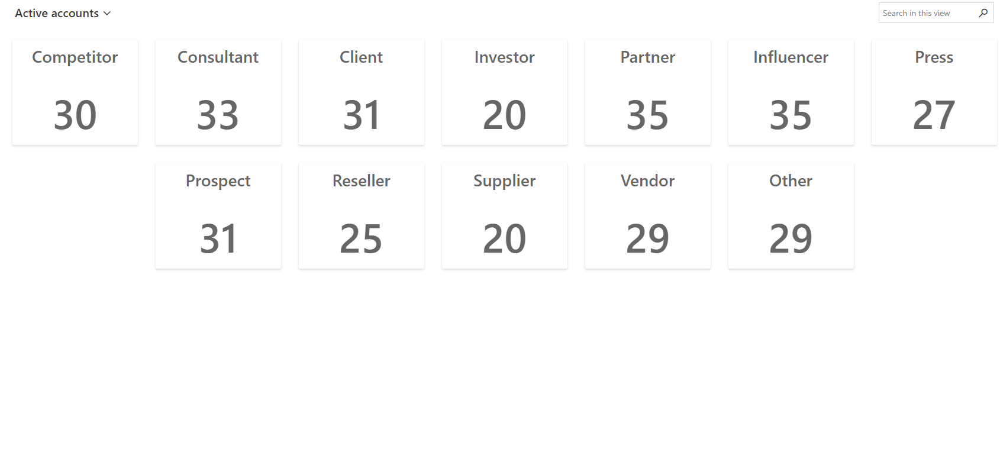

# Card Viewer

## Description

This control has been created to select many records from an entity.
What this will do is to insert the data split by the delimiter you have selected in your control in the single text field this is attached.
This can be useful to retrieve a "list of records" from a single field and it can be used in a plugin.

## Download

[DOWNLOAD LATEST RELEASE](https://github.com/victorsolaya/CardViewer/releases/latest)

## How to configure

1. Add the control to the view that you want to show the cards.

## Parameters

1. Option Set Field -> Field that is going to be used for showing the different options

## Filter

This is filtered based on the filter criteria of the system view.

## Example of configuration

## Demo

## Issues / Questions

If you have any questions or issues regarding this control, please, raise an issue in github or send me an email: me@victorsolaya.com